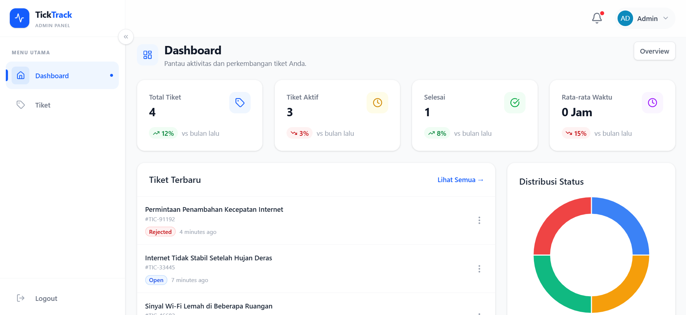
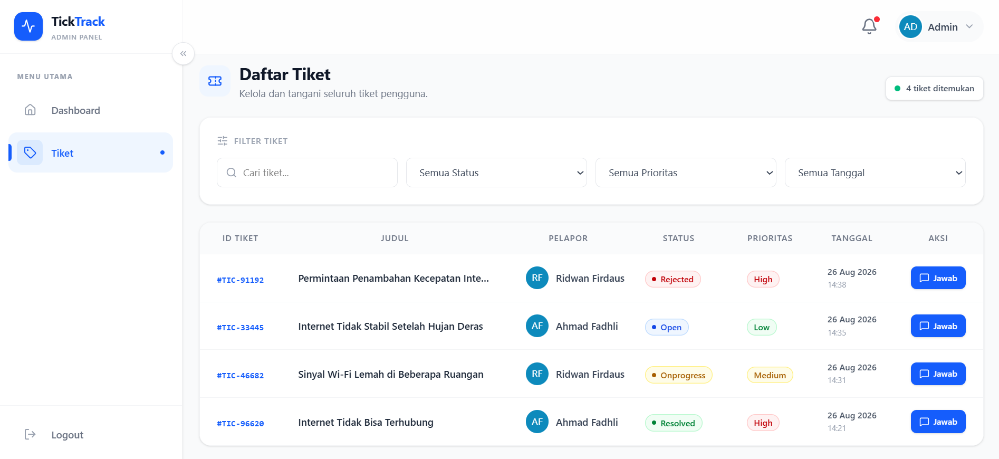
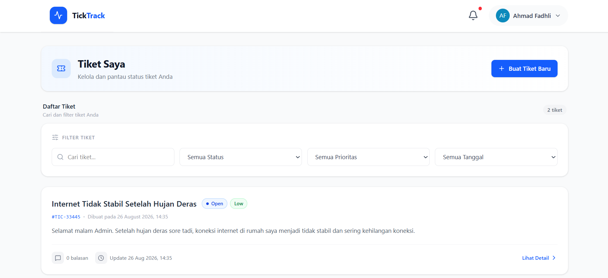

# TickTrack — Ticketing System (Frontend)

**TickTrack** adalah aplikasi web sistem tiket (helpdesk/ticketing) yang memungkinkan pengguna membuat dan melacak tiket permasalahan, sementara admin dapat mengelola, meninjau, dan menanggapi tiket tersebut melalui dashboard khusus. Repositori ini merupakan **frontend** dari aplikasi, dibangun menggunakan React + Vite dan mengonsumsi data dari REST API backend secara terpisah.

## ✨ Fitur Utama

**Untuk Pengguna (User)**
- Registrasi & login akun
- Membuat tiket baru dengan tingkat prioritas (Rendah/Sedang/Tinggi)
- Melihat daftar tiket dengan filter (status, prioritas, tanggal, pencarian)
- Melihat detail tiket & berdiskusi/membalas tiket

**Untuk Admin**
- Dashboard statistik (jumlah tiket per status, grafik status tiket)
- Melihat & mengelola seluruh daftar tiket
- Melihat detail tiket, membalas, dan mengubah status tiket

**Umum**
- Autentikasi berbasis token (disimpan di cookie) dengan proteksi rute berdasarkan role (`user` / `admin`)
- Tampilan responsif dengan Tailwind CSS

## 🛠️ Tech Stack

| Kategori          | Teknologi                                    |
|-------------------|----------------------------------------------|
| Framework         | React 19 + Vite                              |
| Routing           | React Router DOM 7                           |
| Styling           | Tailwind CSS 4                               |
| HTTP Client       | Axios                                        |
| State Management  | React Context API                            |
| Ikon              | Lucide React                                 |
| Grafik/Chart      | Chart.js                                     |
| Utilitas          | Lodash, Luxon (tanggal/waktu), js-cookie     |
| Linting           | ESLint                                       |

## 📁 Struktur Folder

```
src/
├── assets/                      # Aset statis (gambar, dll)
├── components/                  # Komponen UI reusable
│   ├── admin/                   # Komponen khusus tampilan admin (sidebar, dashboard, ticket)
│   ├── user/                    # Komponen khusus tampilan user (navbar, ticket)
│   └── ticket/                  # Komponen tiket yang dipakai bersama
├── helpers/                     # Fungsi bantu (mis. error handler)
├── layouts/                     # Layout halaman (Auth, User, Admin)
├── pages/                       # Halaman aplikasi (auth, user, admin)
├── plugins/                     # Konfigurasi library eksternal (axios)
├── routes/                      # Proteksi rute berdasarkan role (RoleRoute)
├── ticketConstants.js           # Konstanta status & prioritas tiket
├── App.jsx                      # Definisi routing utama
├── AppContext.jsx               # Context global (autentikasi, user)
└── main.jsx                     # Entry point aplikasi
```

## 🚀 Instalasi & Menjalankan Proyek

### Prasyarat
- Node.js versi 18 ke atas
- npm
- Backend/API TickTrack sudah berjalan (lihat bagian [Repositori Terkait](#-repositori-terkait))

### Langkah-langkah

1. Clone repositori ini
   ```bash
   git clone https://github.com/MFadhliAlHafizh/ticketing-system
   cd ticketing-system
   ```

2. Install dependencies
   ```bash
   npm install
   ```

3. Sesuaikan URL API di `src/plugins/axios.js` jika backend tidak berjalan di `http://localhost:8000/api`
   ```js
   axios.defaults.baseURL = 'http://localhost:8000/api'
   ```

4. Jalankan aplikasi dalam mode pengembangan
   ```bash
   npm run dev
   ```
   Aplikasi akan berjalan di `http://localhost:5173` (default Vite).

5. Build untuk produksi
   ```bash
   npm run build
   ```

6. Preview hasil build
   ```bash
   npm run preview
   ```

## 🔗 Repositori Terkait

Proyek ini adalah bagian **frontend** dari sistem TickTrack. Untuk menjalankan aplikasi secara utuh, Anda memerlukan repositori **backend/API** yang menyediakan endpoint seperti `/me`, `/login`, `/logout`, `/ticket`, dan `/dashboard/statistics`.

- 🔧 **Backend/API Repository:** [https://github.com/MFadhliAlHafizh/api-ticketing-system]

> Silakan clone dan jalankan repositori backend terlebih dahulu sesuai instruksi pada README repositori tersebut, sebelum menjalankan frontend ini.

# 📸 Pages Overview





